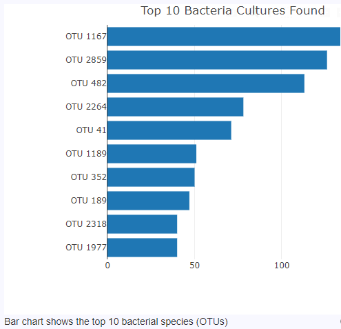
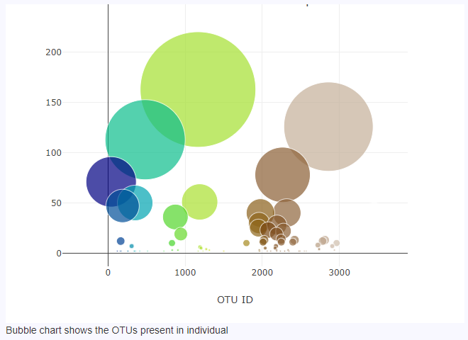
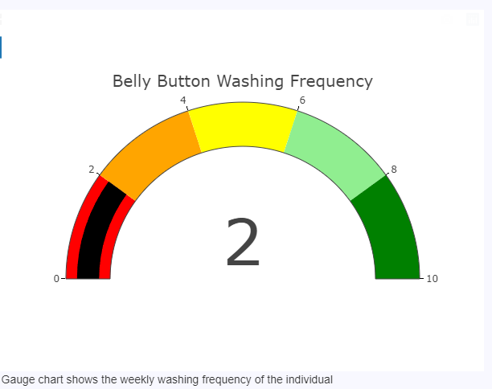
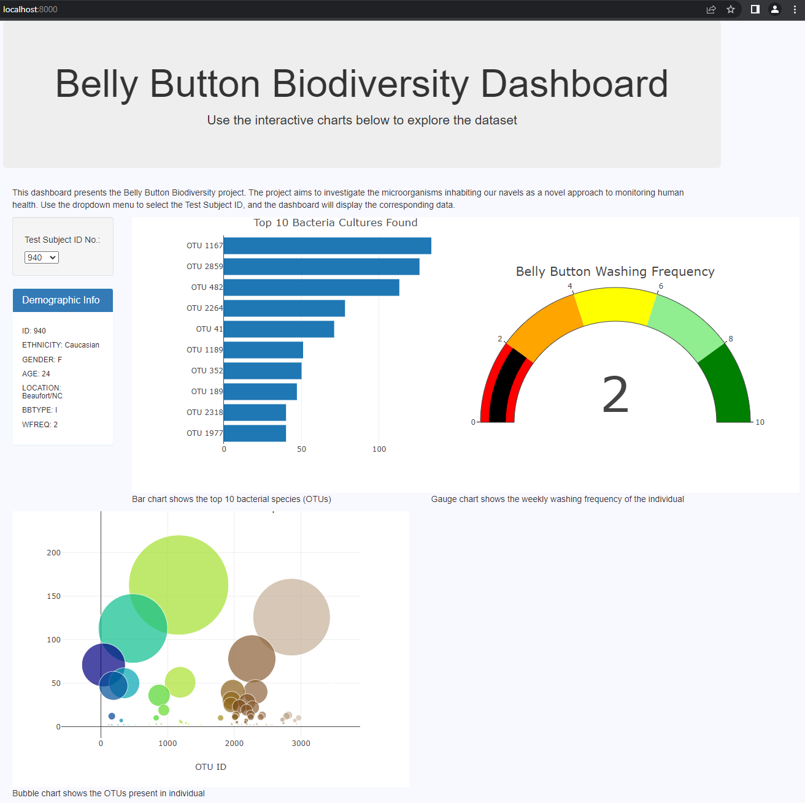

# Plotly_Chart

# Module 13 Challenge

# Belly Button Biodiversity Dashboard

This repository hosts a web-based, interactive dashboard designed to explore the Belly Button Biodiversity Dataset. This dataset catalogs the microbes that inhabit human navels.

## Project Overview

The goal of the project is to create a comprehensive visual exploration tool to allow users to interactively investigate the microorganisms that inhabit our belly buttons. This research can help shed light on what microorganisms are most common in these areas and whether they have any link to our overall health.

## Features

- A dropdown menu enables users to select a test subject's ID number and view their demographic information, along with the following visualizations:

    - **Bar Chart**: Displays the top 10 bacterial species (OTUs) when an individual’s ID is selected.

      

    - **Bubble Chart**: Visualizes the relative frequency of all the bacterial species found in the individual's navel.

      

    - **Gauge Chart**: Shows the weekly washing frequency of the individual’s belly button.

      

- All charts update whenever a new sample is selected from the dropdown menu.
    https://htmlpreview.github.io/?https://github.com/zbarham/Plotly_Chart/blob/main/index.html
  

## Data Source

The data used to populate the dashboard is stored in a JSON file (`samples.json`). It contains three types of data: 

1. `names` - An array of the test subject ID numbers.

2. `metadata` - An array of objects, where each object represents the demographic information of a test subject.

3. `samples` - An array of objects, where each object contains data about the microbial species found in a test subject's navel.

